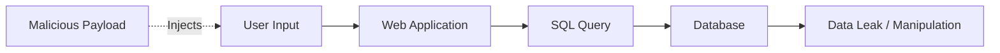

# 💉 SQL Injection

## 📖 Description
SQL Injection (SQLi) is a code injection technique where attackers execute malicious SQL statements to manipulate databases, bypass authentication, access sensitive data, or compromise the underlying server.

## 🎯 Attack Types

### 1. In-band SQL Injection (Classic)
- **Error-based**: Triggering database errors to gain information
- **Union-based**: Using UNION operator to combine queries

### 2. Inferential SQL Injection (Blind)
- **Boolean-based**: Analyzing true/false responses
- **Time-based**: Observing response delays

### 3. Out-of-band SQL Injection
- Using different channels (DNS, HTTP) to extract data
- Requires specific database features to be enabled

## 🔍 Detection Methods

### Manual Detection
1. **Input Testing**: Insert special characters (' " ; --)
2. **Error Analysis**: Watch for database error messages
3. **Response Timing**: Measure response delays
4. **Boolean Testing**: Compare true/false conditions

### Automated Detection
- [SQL Injection Detector](./detection/sql_injection_detector.py) - Automated vulnerability scanning
- Error pattern matching
- Payload testing

## 🛡️ Prevention Strategies

### Primary Defenses
1. **Parameterized Queries** (Prepared Statements)
2. **Stored Procedures** (with proper implementation)
3. **Input Validation** (whitelist approach)
4. **Output Encoding**
5. **Least Privilege** for database accounts

### Secondary Defenses
1. **Web Application Firewall** (WAF)
2. **Database Activity Monitoring**
3. **Escaping User Input** (when parameterization isn't possible)
4. **Regular Security Testing**

### Prevention Examples
- [Parameterized Queries](./prevention/parameterized_queries.py) - Secure database access
- [Input Validation](./prevention/input_validation.py) - Input sanitization

## 📊 Attack Flow


## 💡 Best Practices

### For Developers
```python
# GOOD - Parameterized query
cursor.execute("SELECT * FROM users WHERE email = %s", (user_email,))

# BAD - String concatenation
cursor.execute(f"SELECT * FROM users WHERE email = '{user_email}'")
```
## 🗄 Database Configuration

- **Use Least Privilege Accounts** – Grant only required database permissions  
- **Disable Unwanted Database Features** – Reduce attack surface  
- **Remove Default Accounts** – Delete or secure default credentials  
- **Encrypt Sensitive Data** – Protect data at rest and in transit  

---

## 🔧 Testing Tools

### 🤖 Automated Scanners

- **[SQLMap](https://sqlmap.org/)** – Automatic SQL injection and database takeover tool  
- **[jSQL Injection](https://github.com/ron190/jsql-injection)** – Java-based SQL injection tool  
- **[BBQSQL](https://github.com/neohapsis/bbqsql)** – Blind SQL injection exploitation framework  

---

### 🛠 Manual Testing

- **[Burp Suite](https://portswigger.net/burp)** – Web proxy with SQL injection scanning capabilities  
- **[OWASP ZAP](https://www.zaproxy.org/)** – Open-source web application security scanner  
- **Custom Scripts (Python / Go)** – Tailored scripts for targeted SQL injection testing

## 📝 Example Payloads
### Authentication Bypass
```sql
' OR '1'='1' --
' OR 1=1 --
admin' --
' UNION SELECT * FROM users --
```

### Data Extraction
```sql
' UNION SELECT username, password FROM users --
' AND 1=1 -- 
' AND 1=2 --
'; DROP TABLE users; --
```

### Time-based Blind
```sql
' OR SLEEP(5) --
' WAITFOR DELAY '0:0:5' --
```

## ⚠️ Warning

Only test SQL injection on applications you own or have **explicit permission** to test.  
Unauthorized testing is illegal and unethical.

---

## 📚 References

- [OWASP SQL Injection](https://owasp.org/www-community/attacks/SQL_Injection)  
- [PortSwigger SQL Injection Guide](https://portswigger.net/web-security/sql-injection)  
- [SQLMap Documentation](https://sqlmap.org/)

