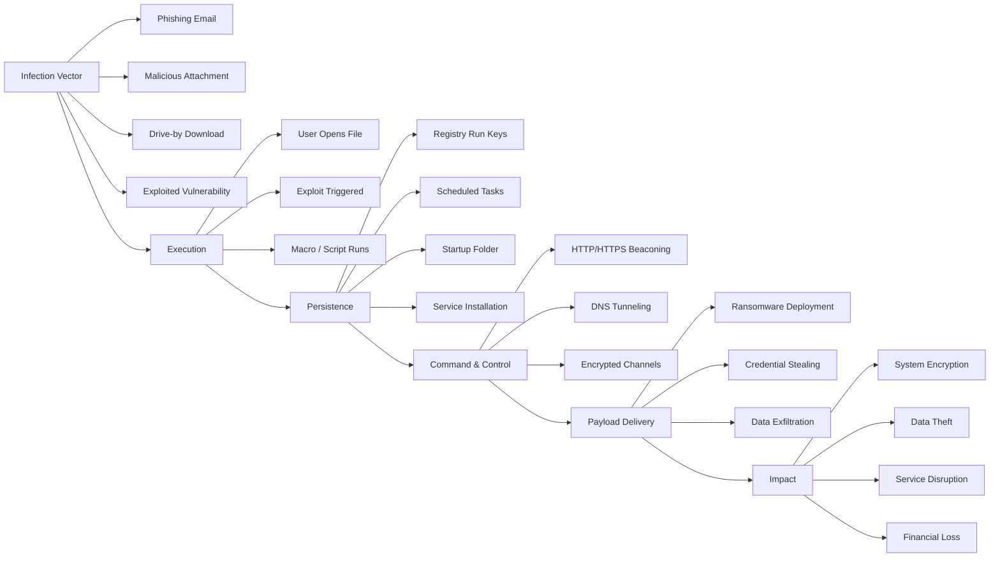

# 🦠 Malware Analysis

[Back to Main](../README.md)

## 📖 Overview
Malware analysis is the study of malicious software to understand its behavior, identify its capabilities, and develop detection and prevention methods. This section covers various types of malware, analysis techniques, and defensive strategies.

## 📋 Categories Covered

1. [Ransomware](./ransomware/README.md) - File-encrypting malware
2. [Trojans](./trojans/README.md) - Deceptive malware
3. [Rootkits](./rootkits/README.md) - System-hiding malware
4. [Keyloggers](./keyloggers/README.md) - Credential stealers
5. [Worms](./worms/README.md) - Self-replicating malware
6. [Botnets](./botnets/README.md) - Controlled networks of malware

## 🛡️ Malware Types

| Type | Description | Common Vectors | Impact |
|------|-------------|----------------|--------|
| Ransomware | Encrypts files for ransom | Email, RDP | Critical |
| Trojan | Disguised as legitimate software | Downloads, USB | High |
| Rootkit | Hides system presence | Exploits, Drivers | Critical |
| Keylogger | Records keystrokes | Phishing, Trojans | High |
| Worm | Self-replicating | Network, Email | Medium |
| Botnet | Controlled network | Various | High |

## 🔬 Analysis Methodologies

### 1. Static Analysis
- Examining code without execution
- File fingerprinting (hashes)
- String analysis
- PE header examination
- Disassembly

### 2. Dynamic Analysis
- Executing in sandbox environment
- Behavior monitoring
- Network traffic analysis
- Process monitoring
- Registry/file system changes

### 3. Memory Analysis
- RAM forensics
- Process dumping
- Rootkit detection
- In-memory payloads

## 🛠️ Analysis Tools

### Static Analysis Tools
- **PE Studio** - PE file analysis
- **IDA Pro** - Disassembler
- **Ghidra** - Reverse engineering
- **Strings** - Extract strings
- **DIE** - Detect It Easy

### Dynamic Analysis Tools
- **Cuckoo Sandbox** - Automated analysis
- **ProcMon** - Process monitor
- **Wireshark** - Network analysis
- **RegShot** - Registry comparison
- **API Monitor** - API call tracking

### Memory Analysis
- **Volatility** - Memory forensics
- **Rekall** - Memory analysis
- **LiME** - Memory acquisition


## 🦠 Malware Lifecycle



## 🚨 Detection Methods

### Signature-Based Detection
- Known malware patterns
- File hashes
- Behavioral signatures
- Network signatures

### Heuristic Analysis
- Suspicious behavior patterns
- Code anomalies
- Anti-debugging techniques
- Packers/obfuscation

### Behavioral Analysis
- File system changes
- Registry modifications
- Process injection
- Network connections

## 💡 Best Practices

### For Analysts
```python
# Always analyze in isolated environment
# Use snapshots for easy restoration
# Document all findings
# Follow responsible disclosure
```
## 🛡️ Prevention

- **Least Privilege** – Limit user permissions  
- **Application Whitelisting** – Only allow approved software  
- **Regular Updates** – Patch vulnerabilities promptly  
- **Email Filtering** – Block malicious attachments  
- **User Training** – Recognize social engineering attacks  

---

## ⚠️ Safety Warnings

> ⚠️ **CRITICAL: Malware analysis is dangerous!**

- ❌ **NEVER** analyze malware on production systems  
- ✅ **ALWAYS** use isolated virtual machines (VMs) with network isolation  
- 🚫 **DISABLE** shared folders and clipboard access  
- 💾 **USE** snapshots before execution  
- 👀 **MONITOR** for escape attempts  
- 📋 **FOLLOW** strict lab safety protocols  

---

## 📚 References

- *Malware Analysis Fundamentals*  
- *Practical Malware Analysis*  
- *OWASP Malware Threats*  
- [VirusTotal](https://www.virustotal.com)  
- [Hybrid Analysis](https://www.hybrid-analysis.com)


