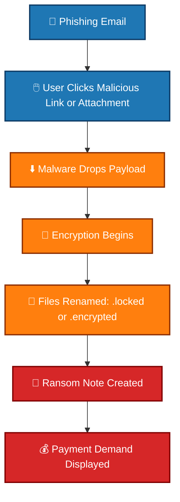
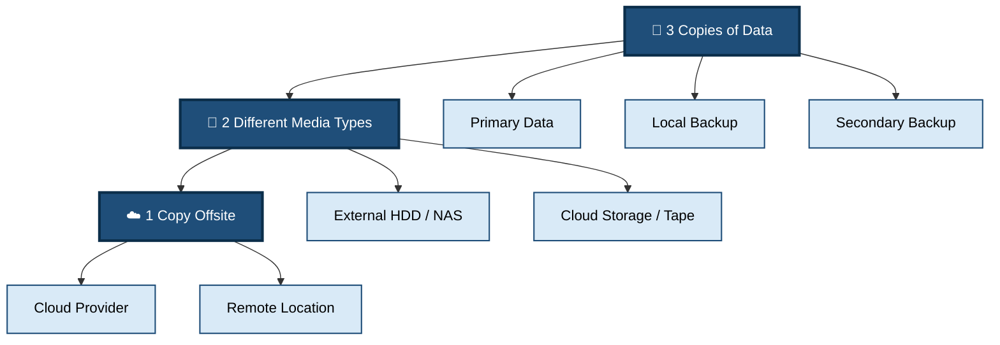

# 🔒 Ransomware

## 📖 Description
Ransomware is a type of malware that encrypts files or locks systems, demanding payment (ransom) for decryption. It's one of the most damaging cyber threats, affecting individuals, businesses, and critical infrastructure.

## 🎯 Types of Ransomware

### 1. Encrypting Ransomware
- **Crypto ransomware** - Encrypts files
- Uses strong encryption (AES, RSA)
- Demands payment for decryption key

### 2. Locker Ransomware
- Locks user out of system
- Doesn't encrypt files
- Shows fake law enforcement notices

### 3. Doxware (Leakware)
- Threatens to publish stolen data
- Double-extortion tactics
- Data breach + encryption

## 🔍 Detection Methods

### Behavioral Indicators
- Rapid file modifications
- Mass file renaming
- Suspicious processes
- Network connections to TOR/C2

### Detection Scripts
- [Ransomware Behavior](./detection/ransomware_behavior.py) - Behavioral analysis
- [File Monitor](./detection/file_monitor.py) - Real-time file change detection

## 🛡️ Prevention Strategies

### Technical Controls
1. **Regular Backups** - 3-2-1 backup strategy
2. **Application Whitelisting** - Only approved software
3. **Email Filtering** - Block malicious attachments
4. **Patch Management** - Keep systems updated
5. **Network Segmentation** - Limit lateral movement

### Prevention Scripts
- [Backup System](./prevention/backup_system.py) - Automated backup solution
- [App Whitelisting](./prevention/app_whitelisting.py) - Application control

## 📊 Attack Flow




## 🚨 Ransomware Indicators

### File System Changes
- Files renamed with new extensions (.encrypted, .locked)
- Ransom notes (README.txt, HOW_TO_DECRYPT.html)
- Desktop wallpaper changed
- Shadow copies deleted

### Process Behavior
- Volume Shadow Copy deletion
- Windows Backup removal
- Encrypting processes
- TOR network connections

## 💡 Best Practices

### 3-2-1 Backup Strategy



### Incident Response

```bash
# 1. Isolate infected system
# 2. Preserve evidence
# 3. Identify ransomware family
# 4. Check for decryptors
# 5. Restore from backups
# 6. NEVER pay the ransom
```
## 📝 Ransomware Families

| Family    | Type        | Extensions | Notes                  |
|------------|------------|------------|------------------------|
| WannaCry   | Encrypting | `.wncry`   | Used EternalBlue exploit |
| Ryuk       | Encrypting | `.ryk`     | Targeted attacks        |
| Locky      | Encrypting | `.locky`   | Spread via email campaigns |
| REvil      | Doxware    | `.REvil`   | Double extortion model  |
| Maze       | Doxware    | `.maze`    | Data theft before encryption |

---

## ⚠️ Critical Warning

> 🚫 **NEVER PAY THE RANSOM**

- ❌ No guarantee files will be restored  
- 💰 Funds criminal activities  
- 📈 Encourages more attacks  
- 🎯 May mark you as a repeat target  

---

## 📚 References

- [No More Ransom](https://www.nomoreransom.org)  
- [Ransomware Tracker](https://ransomwaretracker.abuse.ch)  
- [CISA Ransomware Guide](https://www.cisa.gov/stopransomware)
