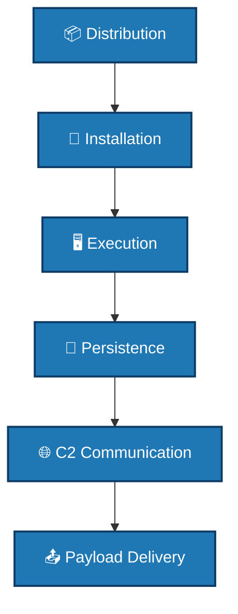

# 🎭 Trojans

[Back to Malware Analysis](../README.md)

## 📖 Description
A Trojan (or Trojan Horse) is a type of malware that disguises itself as legitimate software to trick users into installing it. Unlike viruses and worms, Trojans do not self-replicate but can create backdoors, steal data, or download additional malware.

## 🎯 Types of Trojans

### 1. Remote Access Trojans (RATs)
- Provide attacker with remote control
- Can capture screen, webcam, keystrokes
- Examples: PoisonIvy, DarkComet, njRAT

### 2. Banking Trojans
- Steal financial credentials
- Web injection attacks
- Examples: Zeus, SpyEye, TrickBot

### 3. Backdoor Trojans
- Create hidden access points
- Bypass authentication
- Examples: SubSeven, Back Orifice

### 4. Downloader Trojans
- Download and install other malware
- Often first-stage infection
- Examples: Emotet, Dridex

### 5. Infostealer Trojans
- Steal sensitive information
- Passwords, documents, cookies
- Examples: RedLine, Raccoon Stealer

### 6. DDoS Trojans
- Turn system into bot
- Participate in DDoS attacks
- Examples: Trinoo, TFN

## 🔍 Detection Methods

### Static Analysis
- File signature matching
- PE header examination
- String analysis
- Resource inspection

### Dynamic Analysis
- Process behavior monitoring
- Network traffic analysis
- Registry changes
- File system modifications

### Detection Scripts
- [Trojan Scanner](./detection/trojan_scanner.py) - Signature and heuristic-based scanning
- [Process Analyzer](./detection/process_analyzer.py) - Real-time process monitoring

## 🛡️ Prevention Strategies

### Technical Controls
1. **Antivirus Software** - Regular updates and scans
2. **Application Control** - Block unauthorized software
3. **Email Filtering** - Scan attachments
4. **Web Filtering** - Block malicious downloads
5. **Least Privilege** - Limit user permissions

### Prevention Scripts
- [AV Configuration](./prevention/av_config.py) - Antivirus optimization
- [Sandbox Setup](./prevention/sandbox_setup.py) - Isolated execution environment

## 📊 Trojan Lifecycle




## 🚨 Trojan Indicators

### File System Indicators
- Suspicious files in temp directories
- Hidden files with system attributes
- Files with double extensions (picture.jpg.exe)
- Modified system files

### Process Indicators
- Unknown processes running
- Processes with no windows
- Processes with suspicious names
- High CPU/memory usage

### Network Indicators
- Unexpected outbound connections
- Beaconing traffic patterns
- Connections to known bad IPs
- Encrypted C2 traffic

### Registry Indicators (Windows)
- Auto-run entries in:
  - `HKLM\Software\Microsoft\Windows\CurrentVersion\Run`
  - `HKCU\Software\Microsoft\Windows\CurrentVersion\Run`
  - `HKLM\Software\Microsoft\Windows\CurrentVersion\RunOnce`
- File association hijacking
- Service installations

## 💡 Best Practices

### For Users
```bash
# 1. Don't download from untrusted sources
# 2. Verify file hashes before running
# 3. Keep software updated
# 4. Use ad-blockers
# 5. Be cautious with email attachments
```

## For Administrators
```powershell
# Check for suspicious auto-runs
Get-WmiObject -Query "SELECT * FROM Win32_StartupCommand"

# Monitor network connections
netstat -ano | findstr ESTABLISHED

# Check running processes
Get-Process | Where-Object {$_.Path -like "*temp*"}
```

## 🔧 Common Trojan Analysis Tools

| Tool             | Purpose                   | Platform        |
|-----------------|---------------------------|----------------|
| Process Monitor  | Real-time process activity | Windows        |
| Wireshark        | Network traffic analysis   | Cross-platform |
| PE Studio        | PE file analysis           | Windows        |
| RegShot          | Registry comparison        | Windows        |
| API Monitor      | API call tracking          | Windows        |
| Cuckoo Sandbox   | Automated analysis         | Linux          |

## 📝 Trojan Signatures
### File Hashes (Example)
```text
# Always verify with actual malware samples in isolated environment
Zeus: 3a4b5c6d7e8f9a0b1c2d3e4f5a6b7c8d
PoisonIvy: 1a2b3c4d5e6f7a8b9c0d1e2f3a4b5c6
```

### Network Signatures
```text
# C2 Communication Patterns
GET /gate.php?id={victim_id}
POST /submit.php?data={base64}
User-Agent: Mozilla/4.0 (compatible; MSIE 8.0)
```

## ⚠️ Warning

> ❌ **NEVER** execute trojans on production systems.  
> ✅ Always use **isolated analysis environments** with **network monitoring** and **snapshots**.

---

## 📚 References

- [Trojan Horse (Wikipedia)](https://en.wikipedia.org/wiki/Trojan_horse_(computing))  
- *Malware Analysis Fundamentals*  
- [VirusTotal](https://www.virustotal.com)  
- [Hybrid Analysis](https://www.hybrid-analysis.com)  
- [MalwareBazaar](https://bazaar.abuse.ch)
