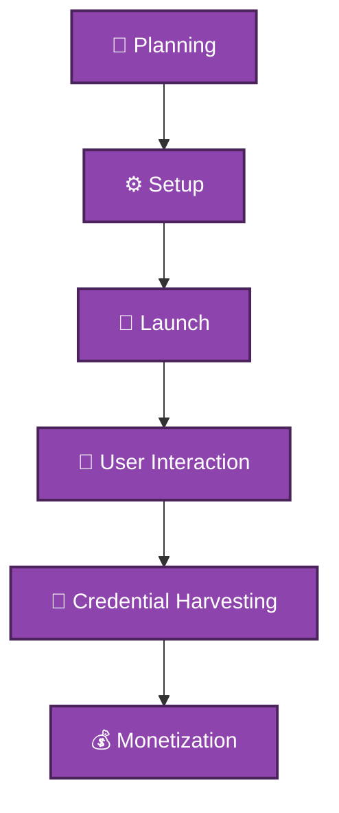

# 📧 Phishing

## 📖 Description
Phishing is a type of social engineering attack where attackers impersonate legitimate organizations or individuals to trick victims into revealing sensitive information, clicking malicious links, or opening infected attachments.

## 🎯 Types of Phishing

### 1. Email Phishing
- Mass emails to many recipients
- Impersonates trusted brands
- Contains malicious links/attachments

### 2. Spear Phishing
- Targeted at specific individuals
- Personalized using victim's information
- Highly convincing and dangerous

### 3. Whaling
- Targets executives and VIPs
- Uses business-related themes
- Financial or data theft focus

### 4. Clone Phishing
- Copies legitimate emails
- Replaces links/attachments
- Exploits previous correspondence

### 5. Angler Phishing
- Uses social media
- Fake customer support accounts
- Intercepts complaints

### 6. Search Engine Phishing
- Creates fake websites
- SEO poisoning
- Appears in search results

## 🔍 Detection Methods

### Technical Analysis
- Email header analysis
- Link reputation checking
- Attachment sandboxing
- Domain age checking
- SSL certificate validation

### Behavioral Analysis
- Urgency indicators
- Language patterns
- Request types
- Sender behavior

### Detection Scripts
- [Phishing Detector](./detection/phishing_detector.py) - Comprehensive analysis
- [Email Analyzer](./detection/email_analyzer.py) - Header and content parsing

## 🛡️ Prevention Strategies

### Technical Controls
1. **SPF/DKIM/DMARC** - Email authentication
2. **Email Filtering** - Spam and malware filters
3. **Web Filtering** - Block malicious sites
4. **MFA** - Prevent credential abuse
5. **Endpoint Protection** - Block malware

### Educational Controls
1. **Regular Training** - Spotting phishing attempts
2. **Phishing Simulations** - Test employees
3. **Reporting Mechanisms** - Easy to report
4. **Security Reminders** - Regular communications

### Prevention Scripts
- [Training Materials](./prevention/training_materials.md) - Educational content
- [Email Filters](./prevention/email_filters.py) - Filtering implementation

## 📊 Phishing Lifecycle



## 🚨 Phishing Indicators

### Email Headers
```
Return-Path: <different-from-sender>
Reply-To: <suspicious-domain.com>
Authentication-Results: spf=fail
DKIM-Signature: missing or invalid
Message-ID: unusual format
Received: from suspicious IP
```

---

## 🚩 What These Mean

- **Return-Path different from sender**  
  → Possible spoofing or bounce address mismatch.

- **Suspicious Reply-To domain**  
  → Replies may go to attacker-controlled inbox.

- **SPF = fail**  
  → Sending server is not authorized for that domain.

- **Missing or invalid DKIM signature**  
  → Email integrity cannot be verified.

- **Unusual Message-ID format**  
  → May indicate non-standard mail server or phishing kit.

- **Received from suspicious IP**  
  → Originates from blacklisted or unexpected geographic location.

---

## 🛡️ Defensive Actions

- Check SPF, DKIM, and DMARC results.
- Verify sending domain reputation.
- Inspect full header chain.
- Use tools like:
  - MXToolbox
  - Google Admin Toolbox
  - VirusTotal (URL/domain checks)


 
## URL Analysis
### 🔎 Key Signs of a Suspicious Site

| Indicator       | Example / Description                             |
|-----------------|--------------------------------------------------|
| **Display Text** | `https://www.paypal.com`                          |
| **Actual Link**  | `http://192.168.1.100/paypal/login`             |
| **Domain Age**   | Less than 30 days                                |
| **SSL**          | Self-signed or expired certificate               |
| **Certificate**  | Domain mismatch (certificate does not match URL) |

---

### 🚩 Defensive Actions

- Always hover over links to check the **actual URL**.  
- Use **WHOIS or domain lookup** to verify domain age and ownership.  
- Check SSL/TLS certificate validity and issuer.  
- Verify HTTPS padlock (though some phishing sites use valid SSL).  
- Report suspicious sites to services like:
  - [Google Safe Browsing](https://transparencyreport.google.com/safe-browsing/search)
  - [PhishTank](https://www.phishtank.com/)
  - [APWG](https://apwg.org/)
 
  
## 💡 Best Practices

### Email Checklist
```markdown
□ Verify sender email address
□ Hover over links before clicking
□ Check for spelling errors
□ Don't open unexpected attachments
□ Verify requests through other channels
□ Don't enter credentials from emails
□ Report suspicious emails
□ Use separate email for registrations
```

### Technical Implementation
```python
# Email authentication records
SPF Record: "v=spf1 include:spf.protection.outlook.com -all"
DKIM: Enable signing for all domains
DMARC: "v=DMARC1; p=reject; rua=mailto:dmarc@domain.com"
```

## 📝 Example Phishing Emails
### PayPal Scam
```text
Subject: Urgent: Your account has been limited

Dear Valued Customer,

We noticed unusual activity on your account.
Please verify your information immediately:

[VERIFY YOUR ACCOUNT] (fake link)

Failure to verify will result in account suspension.

Thank you,
PayPal Security Team
```

### CEO Fraud
```text
Subject: Urgent wire transfer

Hi [Employee],

I'm in a meeting and need you to process an urgent wire transfer.
Amount: $50,000
Account: [Fake Account]
Please confirm when done.

Thanks,
[CEO Name]
```

## 🔧 Phishing Analysis Tools

| Tool               | Purpose        | Type       |
|-------------------|----------------|------------|
| PhishTool          | Email analysis | Free/Paid  |
| URLScan.io         | URL analysis   | Free       |
| VirusTotal         | File/URL scan  | Free       |
| Google Safe Browsing| URL reputation| Free       |
| PhishTank          | Phishing database | Free    |

---

## 📚 References

- [Phishing.org](https://www.phishing.org/)  
- *APWG Phishing Activity Reports*  
- [FTC Phishing Guide](https://www.consumer.ftc.gov/articles/how-recognize-and-avoid-phishing-scams)  
- [CISA Phishing Infographic](https://www.cisa.gov/news-events/alerts)
