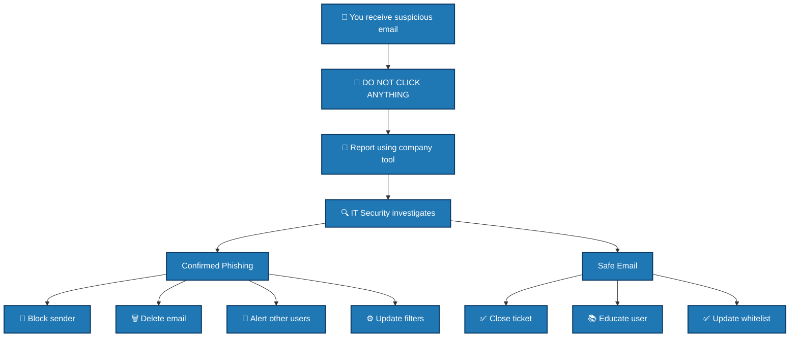

# Phishing Prevention Training Materials

## 📚 Employee Security Awareness Training

### Module 1: What is Phishing?

Phishing is a cyber attack where criminals impersonate legitimate organizations to steal sensitive information. Think of it as digital fishing - attackers cast a wide net hoping someone will bite.

**Key Points:**
- Phishing attacks arrive via email, text, phone, or social media
- Attackers create urgency or fear to bypass your reasoning
- One click can compromise your entire organization

### Module 2: Spotting Phishing Emails

#### The 7 Red Flags Checklist

1. **URGENT OR THREATENING LANGUAGE**  
   - "Your account will be closed immediately!"  
   - "Legal action will be taken!"  

2. **GENERIC GREETINGS**  
   - "Dear Customer" instead of your name  
   - "Dear User" or "Dear Valued Member"  

3. **SUSPICIOUS SENDER ADDRESS**  
   - `@gmai1.com` instead of `@gmail.com`  
   - `@paypaI.com` instead of `@paypal.com`  

4. **POOR GRAMMAR AND SPELLING**  
   - Strange sentence structure  
   - Awkward phrasing  
   - Spelling mistakes  

5. **UNEXPECTED ATTACHMENTS**  
   - `invoice.pdf.exe`  
   - `document.zip`  
   - `voice_message.mp4`  

6. **SUSPICIOUS LINKS**  
   - Hover before clicking  
   - Check if the link matches the display text  
   - Look for misspelled domain names  

7. **REQUESTS FOR PERSONAL INFO**  
   - Passwords  
   - Credit card numbers  
   - Social Security numbers  

---

### ⚠️ Tip
Always verify emails from unknown senders and report suspicious emails to your IT/security team.  


### Module 3: Interactive Examples

#### Example 1: The Fake PayPal Alert

❌ **SUSPICIOUS EMAIL:**
```
From: security@paypaI.com
Subject: URGENT: Your account has been limited

Dear Valued Customer,

We noticed unusual activity on your account.
Please verify your information immediately:
[CLICK HERE TO VERIFY]

Failure to verify will result in account suspension.

Thank you,
PayPal Security Team
```

### 🔎 Suspicious Indicators in This Email

- **Sender Address**: `security@paypaI.com` – notice the capital "I" instead of "l" in `paypal.com`.  
- **Urgent Language**: "URGENT", "Failure to verify will result in account suspension"  
- **Generic Greeting**: "Dear Valued Customer" instead of your actual name  
- **Suspicious Link**: `[CLICK HERE TO VERIFY]` – hover to see actual URL  
- **Request for Sensitive Information**: Asking to verify account credentials  

### ⚠️ Defensive Actions

1. Do **not click** any links.  
2. Verify the sender by contacting the organization directly.  
3. Report suspicious emails to your IT/security team.  
4. Use email security tools (PhishTool, VirusTotal, URLScan.io) to check links.


### Module 6: Phishing Examples by Category

#### Spear Phishing
Targeted attacks using your personal information
```
Hi John, 

I saw your presentation at the security conference.
Check out these slides I mentioned: [LINK]
```


#### Whaling
Targeting executives and VIPs
```
CEO: Please process this wire transfer immediately.
I'm in a confidential meeting and can't access the system.
```


#### Vishing (Voice Phishing)
Phone call scams
```
Hello, this is Microsoft Support. We've detected viruses on your computer.
Please install this software for immediate cleanup.
```


#### Smishing (SMS Phishing)
Text message scams

```
FedEx: Your package delivery failed.
Track your package here: bit.ly/fake-link
```


### Module 7: Security Checklist for Employees

#### Daily Habits
□ Verify unexpected requests through a different channel
□ Hover over links before clicking
□ Check sender addresses carefully
□ Lock computer when away from desk
□ Report suspicious emails immediately

#### Weekly Habits
□ Review security bulletins from IT
□ Complete any pending security training
□ Check for software updates
□ Clear browser cache and cookies

#### Monthly Habits
□ Review account activity for anomalies
□ Update passwords if needed
□ Attend security awareness sessions
□ Test your knowledge with phishing simulations

### Module 8: Reporting Flowchart



### Module 9: Monthly Security Tips

**January:** New Year, New Scams
Be wary of fake "New Year Special" offers and surveys

**February:** Tax Season Scams
Watch for fake IRS emails demanding immediate payment

**March:** Spring Cleaning
Review and delete old emails with sensitive information

**April:** Tax Deadline
Fake tax refund emails peak this month

**May:** Travel Season
Watch for fake flight confirmation emails

**June:** Summer Sale Scams
Be cautious of too-good-to-be-true deals

**July:** Holiday Weekends
Attackers target long weekends when IT staff are away

**August:** Back to School
Fake textbook and supply offers

**September:** Phishing Awareness Month
Extra training and simulations

**October:** Cybersecurity Awareness Month
Special events and workshops

**November:** Holiday Shopping
Peak season for shopping-related scams

**December:** Year-End Scams
Fake charity donations and year-end invoices

### Module 10: Interactive Workshop Exercises

#### Exercise 1: Spot the Phish
Show 5 emails - 3 real, 2 phishing. Have participants identify which are fake.

#### Exercise 2: Link Investigation
Provide suspicious URLs and have participants research:
- WHOIS lookup
- URL unshortening
- Domain age checking

#### Exercise 3: Role Play
Simulate a vishing call where one participant is the attacker and another is the employee.

#### Exercise 4: Policy Creation
Have teams create a one-page security policy for their department.

### Certificate of Completion
```
╔═══════════════════════════════════════╗
║                                       ║
║        CERTIFICATE OF COMPLETION      ║
║                                       ║
║          This certifies that          ║
║                                       ║
║          [EMPLOYEE NAME]             ║
║                                       ║
║         has completed the             ║
║    Phishing Prevention Training       ║
║                                       ║
║ Date: ____________                    ║
║ Trainer: ___________                  ║
║                                       ║
║ ────────────                         ║
║      Security Department              ║
║                                       ║
╚═══════════════════════════════════════╝
```

## 📞 Contact Information

**IT Security Team**
- Email: security@company.com
- Phone: ext. 1234
- Reporting Tool: https://report-phish.company.com

**Emergency:** If you clicked a suspicious link, call IT immediately!

---

*Remember: You are the first line of defense. When in doubt, throw it out!*

